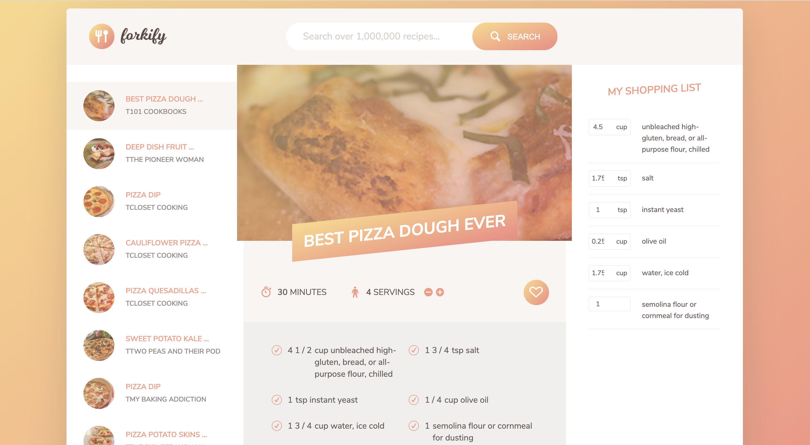

# Forkify Application

> The Forkify App is application for searching recipes, view recipe details and edit shopping lists.

## Table of contents

- [General info](#general-info)
- [Screenshots](#screenshots)
- [Technologies](#technologies)
- [Setup](#setup)
- [Features](#features)
- [Status](#status)
- [Inspiration](#inspiration)
- [Contact](#contact)

## General info

The Forkify application is made of one page, i.e., index.html.

## Screenshots

## Technologies

- Webpack - version 4.43.0
- Javascript - ES6
- axios - version 0.19.2

## Setup

\$ npm install

## Code Examples

Show examples of usage:
`import Search from './models/Search'; import Recipe from './models/Recipe'; import List from './models/List'; import Likes from './models/Likes'; import * as searchView from './views/searchView'; import * as recipeView from './views/recipeView'; import * as listView from './views/listView'; import * as likesView from './views/likesView'; import { elements, renderLoader, clearLoader } from './views/base';`

## Features

List of features ready and TODOs for future development

- Search recipes
- View recipe details
- Edit shopping list

## Status

Project is: _done_

## Inspiration

Add here credits. Project inspired by Jonas Schmedtmann, created on his course: "The Complete JavaScript Course 2020: Build Real Projects!".

## Contact

Created by [@Eva](https://www.facebook.com/profile.php?id=100042321316185) - feel free to contact me!
